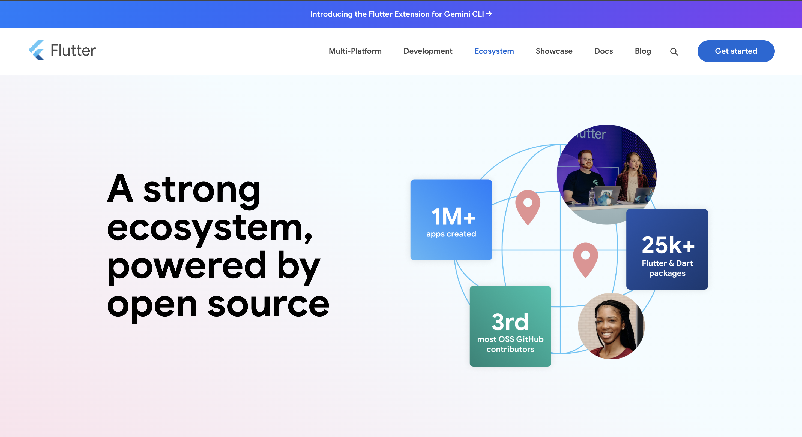

## Flutter Ecosystem Clone



## 🚀 Overview

Welcome to the Flutter Ecosystem Clone! This project is a comprehensive showcase of the Flutter framework's capabilities, highlighting its vibrant community, extensive package library, and seamless cross-platform development tools.

Explore the ecosystem at: [https://dev-hamza03.github.io/flutter-ecosystem-clone/](https://dev-hamza03.github.io/flutter-ecosystem-clone/)

---

## 🧩 Features

- **Community**: Connect with Flutter developers worldwide.
- **Events**: Stay updated with the latest Flutter events and announcements.
- **Packages**: Discover over 20,000 open-source packages and plugins to enhance your Flutter applications.
- **Consultants**: Find trusted Flutter consultants and development partners.
- **Documentation**: Access official Flutter documentation and guides.

---

## 🛠️ Technologies Used

- **HTML/CSS**: For structuring and styling the web pages.
- **SCSS**: For maintainable styling.
- **Flexbox**: For responsive layouts.
- **Remix Icon**: For icons used in the nav bar.

---

## 📦 Getting Started

1. **Clone the repository**:

```bash
git clone https://github.com/dev-hamza03/flutter-ecosystem-clone.git
cd flutter-ecosystem-clone
 ```

2. **Open index.html in your browser**:

```bash
# macOS
open index.html

# Linux
xdg-open index.html

# Windows (Command Prompt or PowerShell)
start index.html
```

---

## 📄 License

This project is open-source and free to use for learning purposes.
EOL
